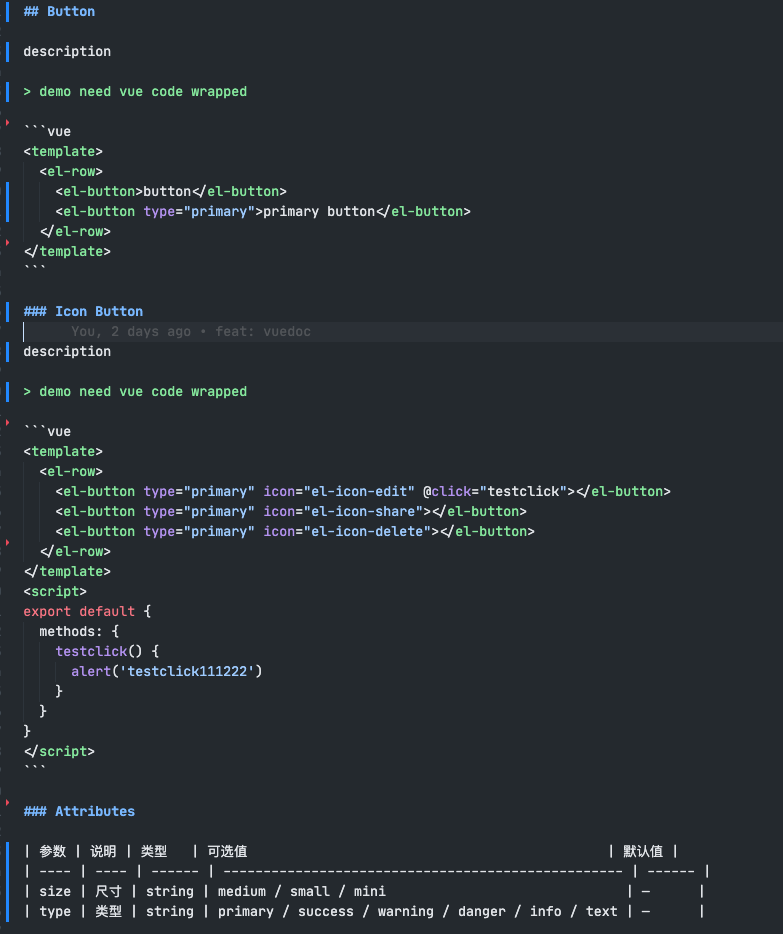
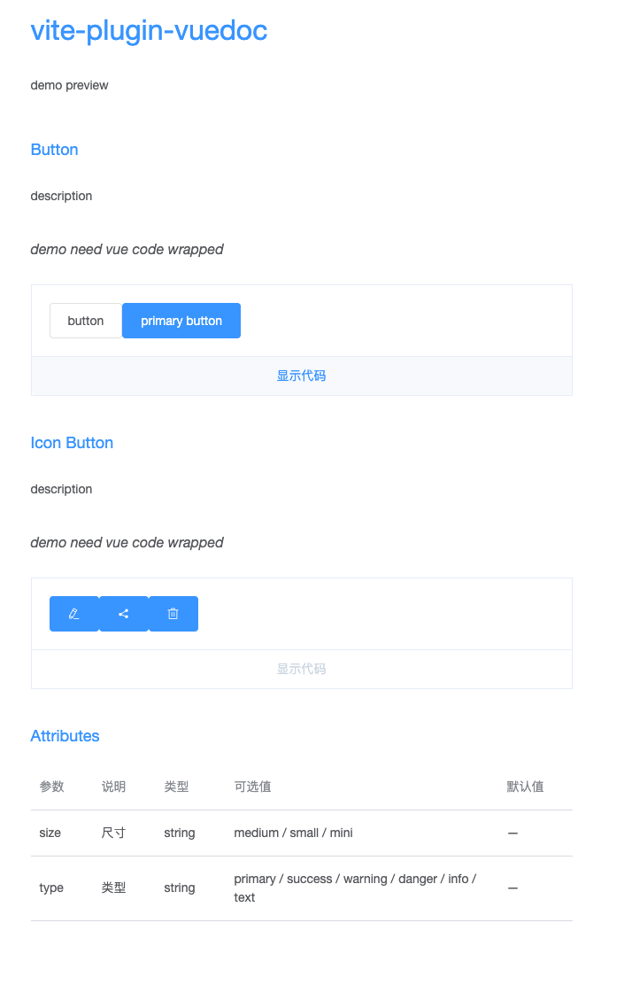
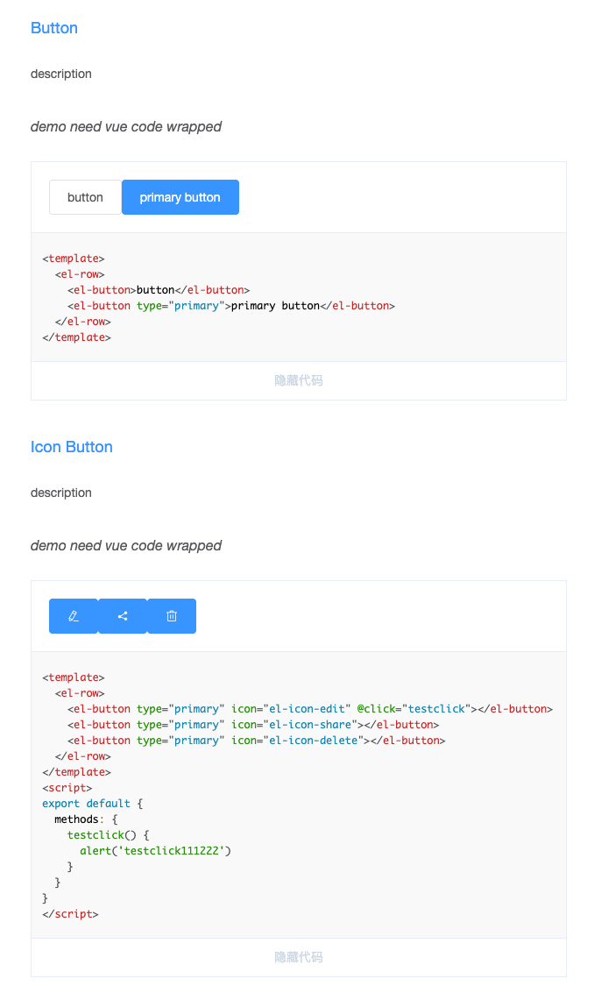

<p>
  <a href="https://www.npmjs.com/package/vite-plugin-vuedoc" target="_blank">
    
  </a>
</p>

# vite-plugin-vuedoc

A vite plugin for markdown & vue preview

## Install

```sh
yarn add vite-plugin-vuedoc
```

## Quick Start

1. use vite-plugin-vuedoc in vite.config.ts

```typescript
// vite.config.ts
import type { UserConfig } from 'vite'
import vitePluginVuedoc from 'vite-plugin-vuedoc'

const config: UserConfig = {
  plugins: [vitePluginVuedoc()]
}

export default config
```

2. markdown doc
   

3. import markdown

```typescript
// router.ts
import { createRouter, createWebHistory } from 'vue-router'
import Layout from './components/Layout.vue'

export const router = createRouter({
  history: createWebHistory(),
  strict: true,
  routes: [
    { path: '/home', redirect: '/' },
    {
      path: '/',
      name: 'Layout',
      component: Layout,
      children: [
        {
          path: '/button',
          name: 'button',
          component: async () => import('./docs/Button.zh-CN.md')
        }
      ]
    }
  ]
})
```

4. screenshots
   

5. show code
   

## Options

```typescript
type VueDocPluginOptions = {
  wrapperClass: string
  previewClass: string
  markdownPlugins: any[]
}
```

- wrapperClass default: vuedoc
  > classname wrapped markdown file
- previewClass default: vuedoc-demo
  > classname wrapped vuedemo
- markdownPlugins default: []
  > markdown-it plugins

## Feature

[] sourcemap
[] better hmr
[] support highlight options
